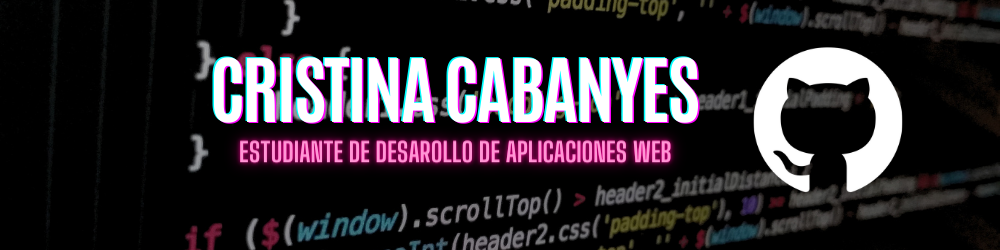
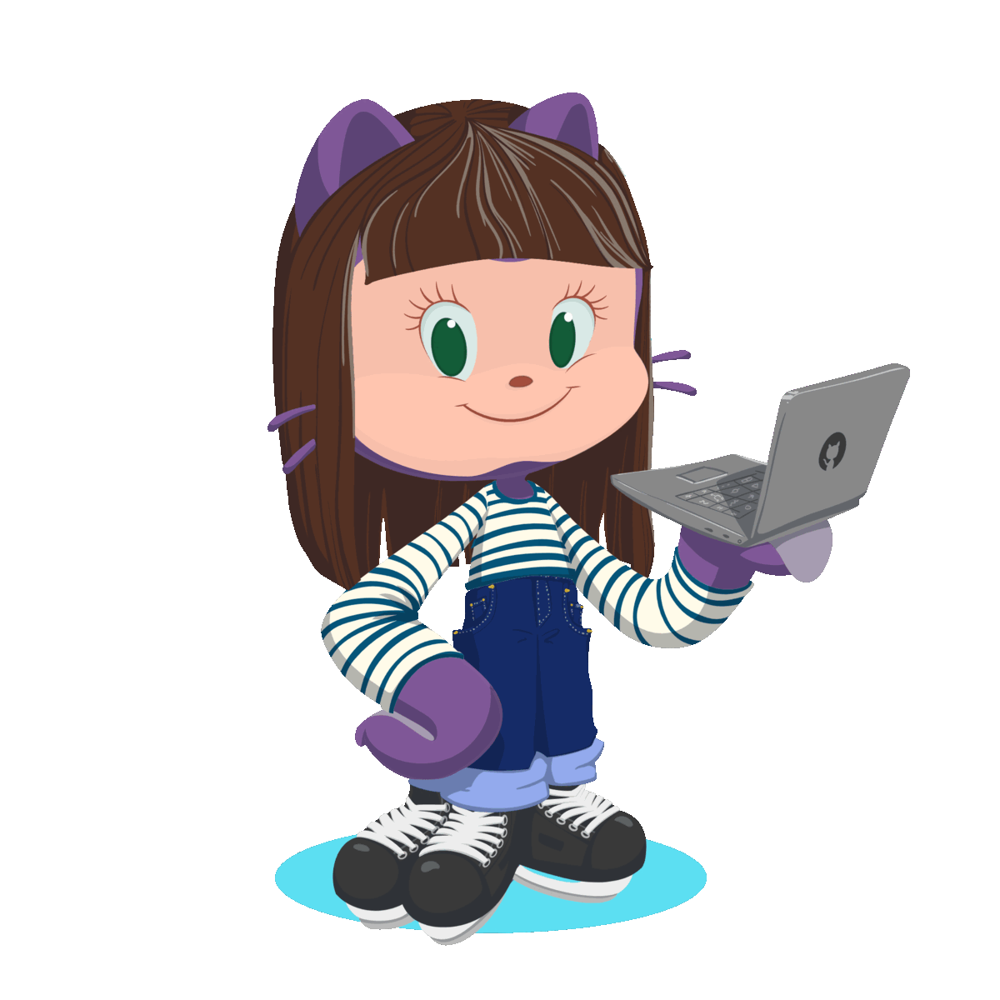

# 👋🏻 Hola, soy Cristina Cabanyes 👩🏻‍💻

Soy Cristina, estudiante de Desarrollo de Aplicaciones Web en el I.E.S Luis Vives y Técnica Superior en Administración y Finanzas.

En junio terminé el Grado Superior en Administración y Finanzas 💰📈 en el instituto I.E.S Pablo Picasso de Pinto. 
Durante mi formación tuve la oportunidad de realizar prácticas en el Departamento de Recursos Humanos en Repsol. 

En septiembre he empezado el Grado Superior de DAW en el Luis Vives, ya que, la Informática y la Tecnología 💻 siempre me han llamado la atención y quería explorar otra salida profesional en el mundo de la programación y desarrollo web.

Como hobbies; me gusta jugar a videojuegos 🎮, ver películas🎬, montar en bici 🚲 y leer 📚.

<h2 align="center">📫 Contacto</h2>

  
  

###
